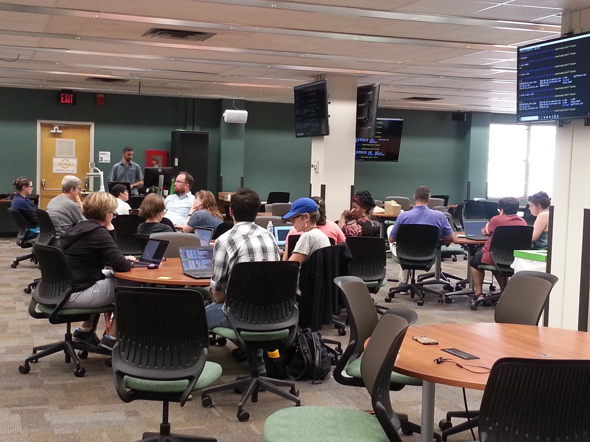

Submit to [https://goo.gl/forms/onNixqK9VkzkDSt03](https://goo.gl/forms/onNixqK9VkzkDSt03)
See examples at: [https://librarycarpentry.org/blog/2018/08/20/oregon-libraries-report/](https://librarycarpentry.org/blog/2018/08/20/oregon-libraries-report/) and
[https://librarycarpentry.org/blog/](https://librarycarpentry.org/blog/)

***

# Data in the desert: Library Carpentry workshop at the University of Arizona

Back by popular demand, the University of Arizona Libraries held its second Library Carpentry workshop on [August 6-7](https://jcoliver.github.io/2018-08-06-lc-tucson). Braving the intense desert heat, learners from the [University of Arizona Libraries](http://new.library.arizona.edu/) and [Arizona State University Library](https://lib.asu.edu/) showed up to learn about research computational tools and best practices in dealing with data. The workshop included 21 learners, five instructors, and two helpers, representing a total of nine departments from the two universities.

To guide the lesson material, the project team first surveyed potential participants to determine which lessons to teach. Given our instructor pool, we asked respondents to rate their interest in the following topics (% respondents indicating "very interested" | "somewhat interested"):

+ Unix command line (53 | 47)
+ Version control with Git (47 | 41)
+ OpenRefine (53 | 47)
+ Creating and using tidy data (82 | 18)
+ Relational databases (SQL) (59 | 41)

Interestingly, only one option (version control with Git) garnered "not interested" responses, and even then, it was only from two survey participants. Based on these responses, as well as experience from the [2017 Library Carpentry workshop](https://jcoliver.github.io/2017-08-09-lc-tucson/), we chose to teach:

+ [Data intro for librarians](https://librarycarpentry.github.io/lc-data-intro/)
+ [UNIX shell](https://librarycarpentry.github.io/lc-shell/)
+ [Tidy data for librarians](https://librarycarpentry.github.io/lc-spreadsheets/)
+ [SQL for librarians](https://librarycarpentry.github.io/lc-sql/)

A portion of the instructor team was recruited from those participants from the 2017 workshop, based on interest in teaching the planned material. All instructors were familiar with the material and made use of the Instructors' Guide for their lesson.

## Learning outcomes

Considering feedback from participants in the post-workshop survey, all respondents felt comfortable in the learning environment, a testament to the instructors' ability to create a positive learning environment. One participant remarked "[The instructors] were very receptive to input and listened to all questions. Since they were not judgmental everyone was encouraged to participate and not made to feel inadequate." Participants also appreciated the hands-on nature of the workshop and the problem-solving approach adopted by the instructors: "When I was struggling with the construction of an SQL search, I asked Fernando what I was doing wrong - rather than telling me the answer, he led me to figuring it out myself."

There was some uncertainty about the immediate applicability of some of the workshop topics. For example, less than half of the participants felt confident in their ability to make use of programming software to work with data and one third of respondents did not think using programming software could make their work easier. Some of this uncertainly likely relates to the nature of individual participants' work, but these feedback highlights potential areas for focus in future Library Carpentry workshops (see [Next Workshop](#the-next-workshop), below).

Some notable responses on the minute cards:
### The Green
+ Loved the hands-on practice on regular expressions
+ Excited to actually mine files using grep
+ So happy to learn about conditional formatting!

### The Red
+ [RegEx] will be overwhelming until we get more practice
+ Still musing on how I will implement [bash] in my work, contextually, but I'm excited about the new tool!
+ It might help to have a guide for basic terms (like ORDER BY, etc.) like we had for Regular Expressions yesterday

## The Next Workshop

Some of the participants were unsure of how to apply some of the material to their daily work. While not all library staff may be expected to use the bash shell or regular expressions in their work, these lessons offer an opportunity to discuss problem solving and concepts like abstraction and atomization that apply to work outside the UNIX command line. Our future Library Carpentry workshops may afford more time for these ideas, combined with hands-on examples of working through increasingly complex tasks.

The material in the [Tidy Data lesson](https://librarycarpentry.github.io/lc-spreadsheets/) was _extremely_ accessible to the majority of the audience. Given the interest, we may consider moving it to the afternoon of the first day, creating a very strong Data Intro/Tidy Data combination. There was some consternation that the [OpenRefine lesson](https://librarycarpentry.github.io/lc-open-refine/) was not taught, so the next workshop will likely include that lesson. A number of the participants also raised the possibility of having regular "one-offs", where each month a single lesson from the Library Carpentry suite is taught one afternoon. While these wouldn't be "official" workshops, they would provide access to learning opportunities that many library staff are demanding.

An encouraging sign: one of the most common questions we received from participants and non-participants alike: "When's the next Library Carpentry workshop?"
